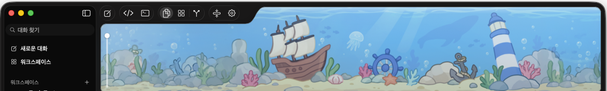

# Puck for macOS

> Language: **English** (here) · [한국어](README.ko.md)

> This is the macOS repo — new home for what used to live at
> [Speaki-e/puck](https://github.com/Speaki-e/puck) (now archived).
>
> Platforms: **macOS** (here) · [Windows](https://github.com/desFernan/puck-windows) · [Linux](https://github.com/desFernan/puck-linux)

### 💬 [Join the Discord](https://discord.gg/nGqtBGP857)

Bugs, feature requests, build help, or just want to hang out — the
[support server](https://discord.gg/nGqtBGP857) is the fastest way to reach
us. Come say hi!

A macOS desktop pet that is also an AI agent. Two Swift apps:

- **Puck** — the pet: an always-on-top character that walks your screen, points
  at things, listens for voice, reads and types into other apps, and drives the
  Mac (`run_shell`, `run_applescript`, click/find UI elements, launch apps).
- **PuckClient** — its window: chat, workspaces, git status, a native SwiftUI
  code editor, and a terminal pane.

Conversations are kept between launches. The agent can hold shells open that
outlive the call that started them — a dev server, a watcher — and can be given
something to run on a schedule ("every morning, check CI"), which runs while
Puck is up. Before you keep what it changed, ⇧⌘R shows the diff file by file,
and puts one back if you would rather it had not.

The two talk over a local socket bridge. The agent core (chat, tools,
approvals, sessions) lives in `pet-app/Puck/Agent`.



That is the island: a panel across the top of the chat window, filled with a
picture. Open the window and the pet walks over and climbs into it; close the
window and it goes home to the desktop. Drop your own `Tank/seabed.png` in and
the island is filled with that instead.

## Install

Download `Puck-<version>.dmg` from
[Releases](https://github.com/desFernan/puck-mac/releases) and drag Puck into
Applications. macOS 14 or newer. The chat window rides inside the app and
comes up with it; there is nothing else to move.

The image is signed ad-hoc rather than with a Developer ID, so the first launch
is refused as coming from an unidentified developer: right-click the app →
**Open** → **Open**. Puck then asks for Accessibility, and for
the microphone, speech recognition and screen recording as you use the features
that need them.

## Build

```sh
sh pet-app/scripts/install.sh   # builds + signs both apps into /Applications
```

Needs Xcode, `xcodegen`, and an Apple Development certificate (a free personal
team is fine — a stable signature is what keeps the Accessibility grant alive
across rebuilds).

## Test

```sh
sh pet-app/scripts/test.sh   # PuckTests + a PuckClient build
```

Unattended, exits nonzero on any failure. Tests needing something this machine
may lack (`node`, a `claude`/`codex` CLI) skip rather than fail.

## Agent providers

Normal chat talks to the Anthropic or OpenAI API directly. The `code_editor`
tool instead runs a vendored ACP agent under `node`, which needs its vendor's
CLI (`claude` or `codex`) installed. Credentials go in Puck's `.env`:
`ANTHROPIC_API_KEY` / `CLAUDE_CODE_OAUTH_TOKEN`, or `CODEX_API_KEY` /
`OPENAI_API_KEY`.

## Making it your own

Everything you can swap lives in one folder:

```
~/Library/Application Support/Puck/
    Avatars/<name>/     one folder per character
    Tank/seabed.png     the picture the island is filled with
```

Right-click Puck's menu bar icon for the quick panel — the toys, mute and
volume, how big the pet is, which way the theme goes — and **설정** in it opens
the settings window: one page each for the avatar, its poses, sound, movement
and the rest. (A left-click on the same icon opens the chat window instead.)

The window's **아바타** page has a button that opens the folder above
(**커스터마이징 폴더 열기**), and creates it if it is not there yet.

### The tank

Drop a `seabed.png` into `Tank/` and it replaces the one the app ships. It is
read once at launch, so restart the pet after changing it. It is
scaled to the island's height with the sides cropped, and repeated end to end
if the window is wider than one copy — so a wide, shallow picture (the bundled
one is 3596×447) fits without repeating on most windows.

### A character

An avatar is a folder with a `manifest.json` and one PNG per clip beside it:

```
Avatars/my-pet/
    manifest.json
    idle.png  walk.png  fall.png  …
    sounds/*.wav
```

#### Adding one, start to finish

1. **Open the folder.** 설정 → 아바타 → **커스터마이징 폴더 열기**. It creates
   `Avatars/` and `Tank/` if they are not there yet, so this also tells you the
   folder exists.
2. **Make a folder for your character** inside `Avatars/`. Its name is the name
   the picker shows: `Avatars/my-pet/` appears as `my-pet`.
3. **Drop in one PNG and a `manifest.json`.** One drawing is a working
   character — `idle` is the only clip that has to exist and every other state
   falls back to it, so you can start with a single picture and add walking,
   climbing and the rest whenever you feel like it. Transparent background,
   drawn facing right (the pet is mirrored when it walks the other way).
   The smallest manifest that works:

   ```json
   {
     "schema_version": 1,
     "name": "my-pet",
     "type": "sprites",
     "hitbox": { "width": 130, "height": 133 },
     "clips": { "idle": "idle" }
   }
   ```

   `hitbox` is your drawing's *proportions*, not its size: every avatar stands
   the same height whatever numbers it declares, and only the ratio between
   these two is read. Match your drawing's aspect ratio or it will look
   squashed. How big the pet actually stands is the size slider in the quick
   panel.
4. **Load it.** 설정 → 아바타 → **아바타 다시 불러오기**, then press **선택**
   next to its name. No restart: the reload button rebuilds the running pet
   from what is on disk, which is also how you see a redrawn sprite or an
   edited manifest without quitting.

If something is wrong with the package the pet does not change and the reason
is in the log (`~/Library/Application Support/Puck/logs/`) — a missing `idle`
file, a manifest that will not parse, or a `schema_version` this build does not
know. The import button (**아바타 패키지 가져오기…**) takes a folder like the
above and copies it in for you, and it checks the package before it does,
so it is the louder way to find out what is missing.

`manifest.json`, with the fields that matter:

```json
{
  "schema_version": 1,
  "name": "my-pet",
  "type": "sprites",
  "scale": 1.0,
  "bounce_intensity": 0.6,
  "hitbox": { "width": 130, "height": 133 },
  "clips":    { "idle": "idle", "walk": "walk" },
  "emotions": { "happy": "beaming" },
  "sounds":   { "land": "sounds/waah.wav" }
}
```

- **`clips`** maps a state to a file *stem*: `"idle": "starry-eyed"` draws
  `starry-eyed.png`. `idle` is the only one required — everything else falls
  back to it, so a single drawing is a working character. The rest are `walk`,
  `climb`, `fall`, `land`, `point`, `type`, `listen`, `react_click`,
  `react_drag`, `kick`, `pet` and `spin`.
- **`emotions`** are swapped in when the agent reacts (`happy`, `thinking`,
  `sad`, `angry`, `love`, `wink`, `laugh`, `cry`, …), same file-stem rule.
- **`sounds`** are paths inside the package, and may sit in a subfolder. Keys
  are clip names plus a few events: `app_launch`, `task_success`, `task_fail`,
  `listen_start`, `kick_<toy>`, `chatter_*`.
- **`hitbox`** is the character's shape — the ratio of its width to its height,
  which is what the pet is clicked, stood and thrown by once it has been drawn
  at the app's own standard height. **`bounce_intensity`** (0–1) is how much
  the squash-and-stretch shows on a still drawing.
- **`type`** must be `sprites`. It is the only kind this build can draw; a
  package declaring anything else is refused by name rather than loaded and
  drawn as nothing.
- Only `schema_version`, `name`, `type`, `hitbox` and `clips` have to be there.
  `scale` defaults to 1, `sounds` and `emotions` to nothing at all, and
  `bounce_intensity` to the app's own default.
- Paths in the manifest stay inside the package: a name that climbs out of it
  is refused rather than read.

Two things on those pages are worth knowing about before you hand-edit
anything. The **아바타** page has a base-image slot, which sets `idle` from one
picture you pick — and since every other clip falls back to `idle`, that alone
is a complete character. The **자세 미리보기** page draws what the pet will look like
walking, climbing each wall and crossing the ceiling in each direction, with a
flip and a quarter turn per pose: that is the way to fix artwork that climbs
head-first without redrawing it.

`pet-app/Puck/Resources/Avatars/dummy` is a complete example, and the import
button takes a folder like the above and copies it in for you.

## Community

Questions, bug reports, feature ideas, or just want to show off your custom
avatar — join us on **[Discord](https://discord.gg/nGqtBGP857)**.

Want to help? [CONTRIBUTING.md](CONTRIBUTING.md) says how to build it, where
the easy issues are, and what a good pull request looks like here.

## License

MIT for the source — see [LICENSE](LICENSE). **Not** for the artwork, icons,
fonts or audio distributed next to it: see
[LICENSE-ASSETS.md](LICENSE-ASSETS.md) for why.
